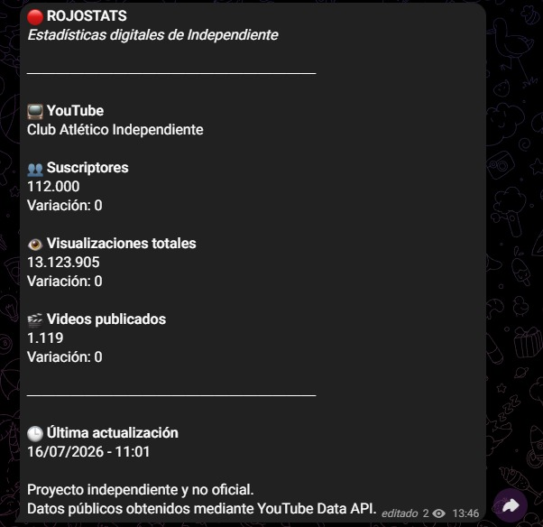

# 🔴 RojoStats

> Monitor automático de estadísticas públicas del canal oficial de YouTube del Club Atlético Independiente.


---

## 📌 Descripción

RojoStats es una aplicación desarrollada en **Python** que consulta estadísticas públicas del canal oficial de YouTube del Club Atlético Independiente mediante la **YouTube Data API v3**.

La aplicación actualiza automáticamente un único mensaje en un canal de Telegram mostrando:

- 👥 Cantidad de suscriptores.
- 👁️ Visualizaciones totales.
- 🎬 Cantidad de videos publicados.
- 📈 Variación respecto de la última consulta.
- 🕒 Fecha y hora de la última actualización.

El proyecto fue desarrollado con una arquitectura modular para facilitar su mantenimiento y futuras ampliaciones.

---

# 📷 Vista previa



# ✨ Funcionalidades

- ✅ Consulta automática de la YouTube Data API.
- ✅ Publicación automática en Telegram.
- ✅ Actualización del mismo mensaje sin generar spam.
- ✅ Cálculo de variaciones.
- ✅ Arquitectura modular.
- ✅ Configuración mediante variables de entorno (.env).
- ✅ Control de errores.
- ✅ Versionado con Git y GitHub.

---

# 🏗 Arquitectura

```
RojoStats
│
├── telegram_service
│   ├── client.py
│   └── formatter.py
│
├── youtube_service
│   └── client.py
│
├── storage
│   └── repository.py
│
├── utils
│   └── numbers.py
│
├── main.py
├── config.py
├── requirements.txt
└── README.md
```

Cada módulo posee una única responsabilidad, facilitando el mantenimiento y la escalabilidad del proyecto.

---

# 🛠 Tecnologías

- Python
- YouTube Data API v3
- Telegram Bot API
- Requests
- python-dotenv
- Git
- GitHub

---

# 🚀 Instalación

Clonar el repositorio

```bash
git clone https://github.com/ThiagoRamas/RojoStats.git
cd RojoStats
```

Crear un entorno virtual

```bash
python -m venv .venv
```

Activarlo (Windows)

```powershell
.\.venv\Scripts\Activate.ps1
```

Instalar dependencias

```bash
pip install -r requirements.txt
```

Crear un archivo `.env`

```env
TOKEN=TU_TOKEN
CANAL=@TuCanal
YOUTUBE_API_KEY=TU_API_KEY
YOUTUBE_HANDLE=@Independiente
```

Ejecutar

```bash
python main.py
```

---

# 🔐 Seguridad

El archivo `.env` se encuentra excluido mediante `.gitignore`, evitando publicar:

- Token del bot de Telegram.
- Clave de la YouTube Data API.
- Información privada de configuración.

---

# 📈 Roadmap

### ✅ v1.0

- Integración con YouTube Data API.
- Integración con Telegram.
- Arquitectura modular.
- Variables de entorno.
- Git y GitHub.

### 🔜 Próximas versiones

- Automatización de la actualización.
- Registro de logs.
- Historial de estadísticas.
- Dashboard web (opcional).

---

# 👨‍💻 Autor

**Thiago Ramas**

Estudiante de Licenciatura en Sistemas.

GitHub:
https://github.com/ThiagoRamas

---

# 📄 Licencia

Proyecto desarrollado con fines educativos y de portfolio.

No está afiliado ni representa oficialmente al Club Atlético Independiente.